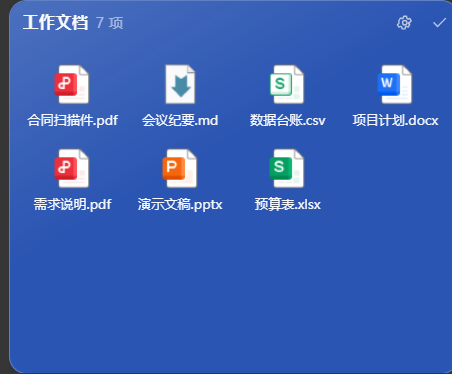
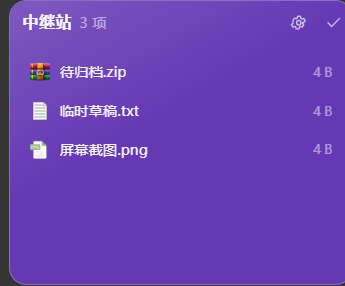
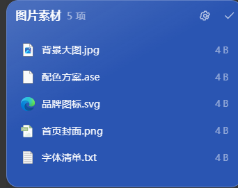

<div align="center">


# 云屉 CloudTray

**把桌面收进贴边的小抽屉。**

收纳窗 · 中转站 · Dock 栏 —— 一个轻量的 Windows 桌面整理工具

[](#)
[](#)
[](#)
[](LICENSE)

[功能](#功能) · [截图](#截图) · [下载](#下载与安装) · [构建](#从源码构建) · [结构](#项目结构)

</div>

---

## 这是什么

桌面上的文件越堆越多，图标铺满整屏却找不到东西。**云屉**把这些文件收进贴着屏幕边缘的小窗口里：
平时只占一个小方块，鼠标一悬停就展开，移开又自动收起。

文件名取自「抽屉」——一屉一屉地把桌面收好。三种形态各司其职：

| 形态 | 用途 |
| --- | --- |
| **收纳窗** | 把相关的文件归到一屉。可悬浮摆放，也可吸附桌面网格自动避让 |
| **中转站** | 贴在某条屏幕边缘的临时中转区，拖进来暂存，回头再整理 |
| **Dock 栏** | 一栏快捷方式，鼠标划过会像 macOS Dock 一样放大 |

它不做云同步、不联网、不收集任何数据。所有内容都在你自己的磁盘上，`config.json` 是普通
文本，随时可以打开看和改。

---

## 截图

### 设置界面

九个板块，左侧导航，现代简洁白色风格。


### 三种窗口

<table>
<tr>
<td width="50%">

**收纳窗（图标模式）** —— 直接读系统图标，和资源管理器里看到的一致



</td>
<td width="50%">

**中转站（精简模式）** —— 贴边窄条，带文件大小



</td>
</tr>
<tr>
<td>

**收纳窗（精简模式）** —— 单列列表，信息密度更高



</td>
<td>

**Dock 栏** —— 读快捷方式目标的真实图标


</td>
</tr>
</table>

---

## 功能

### 九个设置板块

| 板块 | 内容 |
| --- | --- |
| **系统** | 本地诊断包导出、开机启动、文件夹右键菜单、桌面右键菜单、三档性能、三语界面、默认存储路径 |
| **显示** | 收缩标志开关、便签与待办置顶、边缘弧光、收起/展开名称大小（60%~100%）、统一入口大小 |
| **右键菜单** | 14 个菜单项逐项开关（添加项目、创建文件夹/便签/待办、粘贴、删除、重命名、窗口复制、三种模式切换、隐藏名称、打开目录、设置） |
| **交互** | 悬浮展开、离开收缩、点击窗外收缩、判定时间、中转站触发距离与等待时间、窗口自动对齐、单窗展开、悬浮放大倍率 |
| **主题** | 收纳窗 / 中转站 / Dock 栏 / 设置界面四类目标独立配色，10 组预设 + RGB 自定义，玻璃与纯色两种背景模式，独立调节不透明度与模糊强度 |
| **收纳窗** | 悬浮/定位两种放置模式，收缩/展开两种行为，图标/精简两种内容模式，行列网格可调 |
| **中转站** | 贴靠显示器四边，行列可调，同一边缘只允许一个 |
| **Dock 栏** | 横纵排列、图标大小 24~96px、图标间隔可调，随内容自动伸缩 |
| **更新** | 自动检查、当前版本与最高版本对照、版本说明，支持自定义更新源 |

### 用起来顺手的地方

- **拖进拖出**：文件拖到窗口上即收纳（按住 <kbd>Ctrl</kbd> 为复制）；把项目拖回资源管理器即移出
- **真实图标**：读取系统图标，`.lnk` 会解析到目标程序，Dock 里每个图标都能认出来
- **删除不丢文件**：删窗口前会问「整个文件夹移到桌面」还是「文件留在原路径」，空目录不会在桌面留空文件夹
- **诊断包**：一键导出 ZIP，里面是可读的 JSON 与日志，方便排查问题或手工改配置
- **三语界面**：简体中文 / English / 日本語，310 条文案三语键名完全对齐

---

## 下载与安装

到 [**Releases**](../../releases) 页面下载最新版本：

| 文件 | 说明 |
| --- | --- |
| `云屉-x.y.z-安装包.exe` | **安装版**。双击安装，自动创建桌面与开始菜单快捷方式，不需要管理员权限 |
| `云屉-x.y.z-便携版-x64.zip` | **便携版**。解压到任意文件夹，双击 `CloudTray.exe` 即用，数据留在程序旁的 `data\` |

**系统要求**：Windows 10 1809 及以上（64 位）。玻璃模式需要 Windows 11。

数据位置：

| 版本 | 设置与内容 |
| --- | --- |
| 安装版 | `%APPDATA%\云屉` |
| 便携版 | `<程序目录>\data` |

> 从旧名字（收纳桌面 / TuckDesk）升级时，首次启动会自动迁移旧数据目录并改写配置里的保存路径，
> 不需要手动搬文件。

---

## 从源码构建

需要 **Node.js 20+** 与网络（首次会下载约 250 MB 的 Electron 运行时）。

```bash
git clone https://github.com/<your-name>/cloudtray.git
cd cloudtray
npm install     # 安装依赖并下载 Electron
npm start       # 开发模式直接运行
```

打包：

```bash
npm run icon    # 生成图标（build/icon.ico、assets/*.png）
npm run dist    # 打包安装包 + 便携 zip，输出到 dist/
npm run pack    # 只生成未打包目录 dist/win-unpacked，调试构建配置时更快
```

`npm run dist` 产出（构建期用 ASCII 文件名，结束后自动改成中文名）：

- `CloudTray-x.y.z-Setup.exe` → `云屉-x.y.z-安装包.exe`
- `CloudTray-x.y.z-x64.zip` → `云屉-x.y.z-便携版-x64.zip`

> **关于网络**：`package-lock.json` 指向官方源 `registry.npmjs.org`。
> 中国大陆网络下如果安装缓慢，可临时切到国内镜像：
>
> ```bash
> npm install --registry=https://registry.npmmirror.com
> ```
>
> Electron 运行时（约 250 MB）的下载源由 `.npmrc` 里的 `electron_mirror` 控制，
> 不需要的话删掉该文件即可回落到官方源。

> **关于构建缓存**：`electron-builder` 会把 7-Zip、NSIS 等工具下载到 `ELECTRON_BUILDER_CACHE`
> （默认在用户缓存目录）。如果构建环境对可执行文件的写权限有限制，把缓存指到普通目录即可：
>
> ```powershell
> $env:ELECTRON_BUILDER_CACHE = "C:\build-cache\electron-builder"
> $env:ELECTRON_CACHE         = "C:\build-cache\electron"
> npm run dist
> ```

---

## 项目结构

```
src/
├── main/                    主进程
│   ├── main.js              入口：窗口、托盘、IPC 路由
│   ├── store.js             配置存储与数据模型（含容错清洗）
│   ├── wins.js              收纳窗 / 中转站 / Dock 栏 的窗口管理
│   ├── stickies.js          便签与待办
│   ├── shell.js             开机启动、资源管理器右键菜单
│   ├── diagnostics.js       诊断包导出
│   ├── fsops.js             文件操作（含回收站、跨盘移动、快捷方式图标）
│   ├── grid.js              定位模式的桌面网格
│   ├── updater.js           版本检查
│   ├── zip.js               零依赖 ZIP 打包器
│   ├── logger.js            滚动日志
│   ├── paths.js             数据目录解析与旧版本迁移
│   ├── i18n.js              多语言
│   └── locales/             zh-CN / en-US / ja-JP
├── preload/preload.js       contextBridge 白名单
└── renderer/                设置界面 + surface（三种窗口）+ 便签 + 待办
scripts/
├── make-icon.js             纯 JS 生成 PNG / ICO 图标
├── postinstall.js           下载 Electron 运行时（带存在性判断）
└── rename-artifacts.js      构建产物改中文名
build/                       icon.ico、installer.nsh
resources/                   内置版本清单 update-feed.json
```

---

## 设计要点

**零运行时依赖。** 不引入任何 npm 运行时包。ZIP 打包器（`src/main/zip.js`，zlib + CRC32）、
图标生成器（`scripts/make-icon.js`，手写 PNG 编码与 ICO 容器）都是自己实现的，因此
`npm install` 只需要 Electron 与 electron-builder 两个开发依赖，没有原生模块编译。

**配置可读可改。** 全部设置放在一个 `config.json` 里。读取时做形状清洗与范围收敛，
容忍 UTF-8 BOM、缺失字段、类型错误；真的改坏了会自动备份成 `config.json.broken-<时间戳>`
并使用默认值，不会静默覆盖用户数据。

**几何变更只有一个出口。** 所有窗口尺寸与位置的改动都经过 `wins.js` 的 `applyBounds()`。
窗口的「内容尺寸」与「窗口尺寸」相差一条不可见边框，混用会让位置逐帧漂移、甚至形成
自我放大的正反馈——收敛到单一出口后，这类问题从结构上被排除。
设置 `TUCKDESK_TRACE_BOUNDS=1` 可输出每次几何变更的来源与前后尺寸。

**拖动不怕丢事件。** 拖动偏移量由主进程用光标位置与窗口矩形自算（避免跨进程 DPI 不一致），
渲染层用 `setPointerCapture` 保证 `pointerup` 一定送达，主进程再加窗口失焦、指针静止 9 秒、
120 秒硬上限三重兜底。

**安全边界。** 渲染层关闭 `nodeIntegration`，全部能力经 `preload.js` 白名单暴露；
右键菜单、开机启动只写 `HKCU`，不需要管理员权限，可随时关闭并完整还原。

---

## 已知限制

- **仅支持 Windows**。玻璃模式依赖 Windows 11 的亚克力材质；Windows 10 会自动降级为半透明纯色
- **安装包未做代码签名**，首次运行 Windows SmartScreen 可能提示「未知发布者」，选择「仍要运行」即可
- **开机启动与右键菜单写注册表**，部分安全软件可能拦截，拦截后设置界面会给出提示
- 收纳窗的定位模式按固定步距切分网格，多显示器 + 高 DPI 混合缩放下位置可能有几像素偏差

---

## 致谢

作者：南京信息职业技术学院   一屿Yy

## 许可

[MIT](LICENSE)
